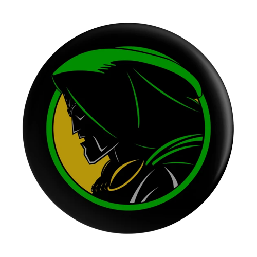

# Doctor Doom



## Description

Doctor Doom will destroy files which are:

- Live longer than certain time (default 30 days)
Doctor Doom will alway find file victims in recursive way. It will not destroy the folder itself.

## Environment

- `DOOM_PATH`: The root folder path, where Dr.Doom will look for files to destroy
- `CIRCLE`: The time interval (in time unit, integer ) between each Dr.Doom run. Cron tab definition ex: `0 0 * * 0` (every Sunday at midnight)   
- `RULE_AGE`: Search for regular files that were modified over `RULE_AGE` ago
  - `age`: The time (in time unit) a file must be older than to be destroyed. Default is 30d
    - `d`: day
    - `h`: hour
    - `m`: minute


## Override default value

**WHAT OVERRIDE WHAT**

`Default Config` << `Environment Config` << `File Config`

### Using environment variable

#### Docker container

```bash
docker run -d --name dr-doom -e DOOM_PATH="/home_user" \
-e CIRCLE="0 0 * * *" \
-e RULE_AGE="30d" \
-v /home/user:/home_user \
-e RULE_AND="true" \
--restart unless-stopped \
mrnim94/doctor-doom:latest \
./doctor-doom
```

#### Docker compose

```yaml
version: "3.7"
services:
  dr-doom:
    image: mrnim94/doctor-doom:latest
    container_name: dr-doom
    environment:
      - DOOM_PATH="/home_user"
      - CIRCLE="0 0 * * *"
      - RULE_AGE="30d"
    volumes:
      - /home/user:/home_user
    restart: unless-stopped
```

#### K8s - deployment

```yaml
apiVersion: apps/v1
kind: Deployment
metadata:
  name: doctor-doom
  labels:
    app: doctor-doom
spec:
  replicas: 1
  selector:
    matchLabels:
      app: doctor-doom
  template:
    metadata:
      labels:
        app: doctor-doom
    spec:
      volumes:
        - name: file-service
          persistentVolumeClaim:
            claimName: pvc-file-service-smb
      containers:
      - name: doctor-doom
        image: mrnim94/doctor-doom:latest
        volumeMounts:
          - name: file-service
            mountPath: /app/downloaded
        env:
          - name: DOOM_PATH
            value: /app/downloaded
          - name: CIRCLE
            value: "* * * * *"
          - name: RULE_AGE
            value: "1d"
      nodeSelector:
        kubernetes.io/os: linux

```

## Dependencies

- [Uber Zap](https://github.com/uber-go/zap)
- [Lumberjack v2](https://pkg.go.dev/gopkg.in/natefinch/lumberjack.v2?utm_source=godoc)
- [Cron v3](https://pkg.go.dev/github.com/robfig/cron/v3@v3.0.0)
- [YAML v2](https://pkg.go.dev/gopkg.in/yaml.v2@v2.4.0)
- [CLI v2](https://pkg.go.dev/github.com/urfave/cli/v2@v2.23.6)
